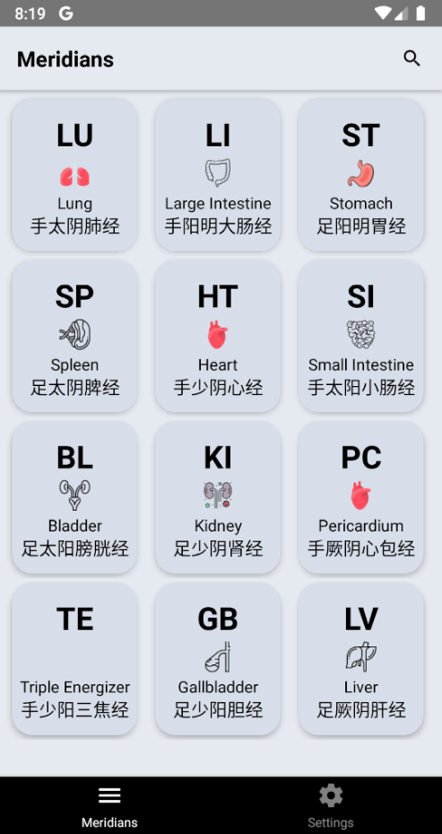
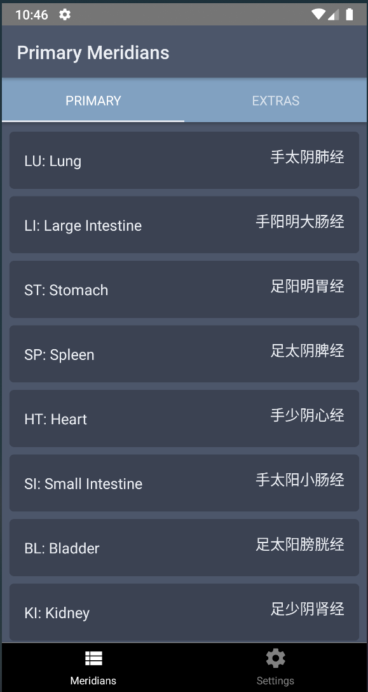

# Mapupuncture

### Motivation

My dad got his accupuncture license this year and did great at his school with the curriculum because of a memorization technique he implemented. He now teaches (remotely now) this technique to his students and believes a mobile application would be a great tool to accomdate his teaching as well as a general tool for aspiring accupuncturists.

### Random Thoughts

- I want to try Flutter because Google made it and I really liked Angular. Figuring they would use a lot of the same principles
- Formatting on a small screen is way nicer
- Elevation looks great

### Tools

- React Native
- Firebase
- Redux Toolkit
- Redux/Thunk
- Styled Components

### Todos

- -variant-release doesn't open anymore, I can't think of anything that I changed that would lead to this. Dev works fine, added Google Console signing keys to Firebase. Annoying.
- Component with an image. Position of various meridian points on the image. Overlay a set of annotations on the image based on coordinates..
- Plan heaviliy ^ (no 3D because that doesn't seem to be supported well in RN)
- Refix settings page and figure out the sign out button positioning

### Progress

##### Week 6 - 8

Working on feedback from my dad

- Testing in React Native with Jest. Low amount of documentation and people actually writing tests is making this quite difficult. Particularly surrounding React Native specific issues.
- I tested for a correct App render though
- Working on cleaning up the Play Store Listing, additional tweaks
- `implementation 'com.facebook.soloader:soloader:0.9.0+'` saved my release build
- React Native release build no longer opens for some reason, didn't change anything in the gradle files/etc. Development version continues to work fine.
- Adding icons, DRY for margins and customizable components. Trying to get Firebase to work in the release build of my app. Added the Google Play Console key
- Prevent rotating to landscape, remove extra chinese characters from Meridian Group Names
- Make submit note, add, edit, and submit image button larger

##### Week 5

- Working on trying to publish for internal testing on the Play Store
- Install on Dad's phone to get feedback and make changes
- Add security rules for Firestore and Firebase Database and limit read/write to each user
- Create fake privacy policy page on my website to link to, for now
- Firebase not working with release build, causing a lot of headaches

##### Week 4

- Finally got the extra data for the the accupuncture points like location and whatnot
- Search bar, navigating directly to the swiper screen will break the component after a couple searches. The best work around I could find wass by navigating to the home screen of each tab first to reset the stack.
- Was going to move the submit note button away from on top of the text input for user experience but it doesn't change anything. Clicks don't register when a text input is focused
- Rename files and components for clarity and consistency
- Create separate screen for details, swipers screen etc.

##### Week 3

- Creating a full screen modal for the search, should be easier to manage
- Tweak search bar, not as important, but figure out which fields of data to search then how to search it
- Keep tweaking my personal website because responsiveness is terrible, I think it should be okay
- Refactor for code and new redesign
- Clean up styled components to inherit more properties when possible
- Create modal to give an option between switching or editing the image
- Add bottom sheet modal with accupuncture point details (Need to get location and other custom information into the application once that is collected)
- Find icons (temp) for various Meridians

##### Week 2

- Allow a user to edit an image after selecting one in their camera roll thanks to ([react-native-photo-editor](https://github.com/prscX/react-native-photo-editor))
- Add a note to the image, update note individually or note and selected image together
- Upload the image to Firebase Storage, and create an associated link to the image in Firestore
- Setup thunk middleware to dispatch loading and finished loading state changes when signing in (then also for the image upload...although its a little overwhelming right now)
- Create a slice for the userImages separate from the auth state, allow for uploading the image and all that inside the reducer
- Grab user images when the user is finished authenticating.
- Add a loading overlay for each individual accupuncture point when uploading an image

##### Week 1

- Creating a redux store to toggle between light and dark themes
- Setting up the stack navigator and tab screens, other basic navigation
- Styling is very basic because I am not exactly sure what information needs to be shown yet, keeping the pages simple for that specific reason
- Implement signing in through Firebase
- Aggregate accupuncture meridians data into csv format from Wikipedia (thanks to Regex101.com and Wiki Tables for being fairly consistents)
- Select an image to upload

## Attributions

- <a href='https://www.freepik.com/free-photos-vectors/city'>City vector created by stories - www.freepik.com</a>
